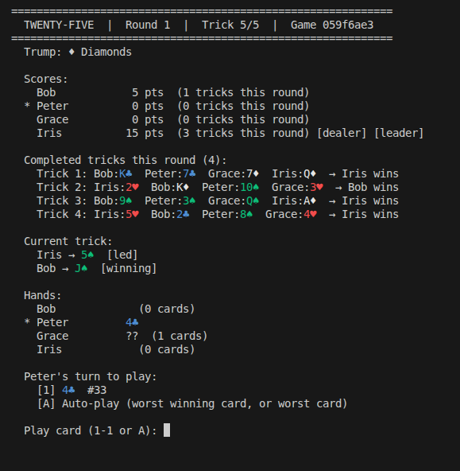
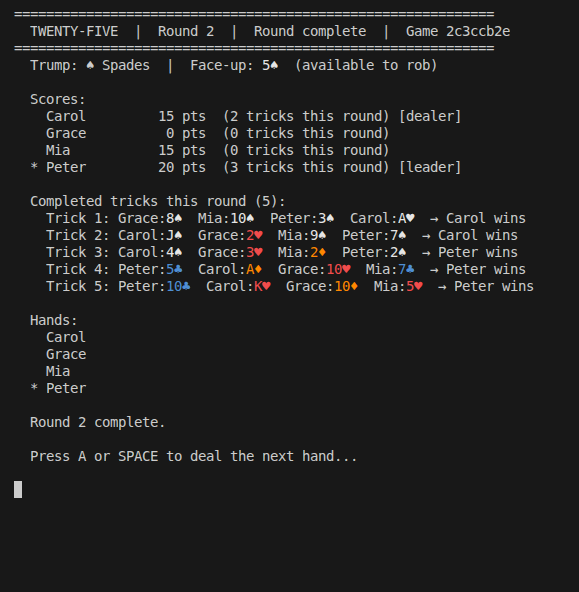
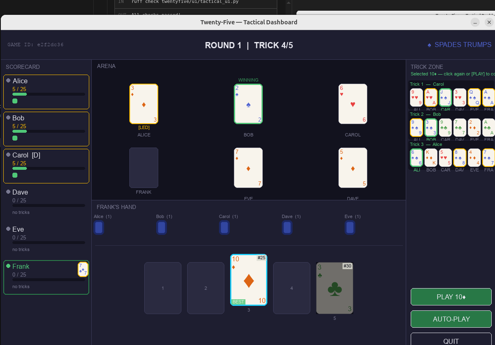
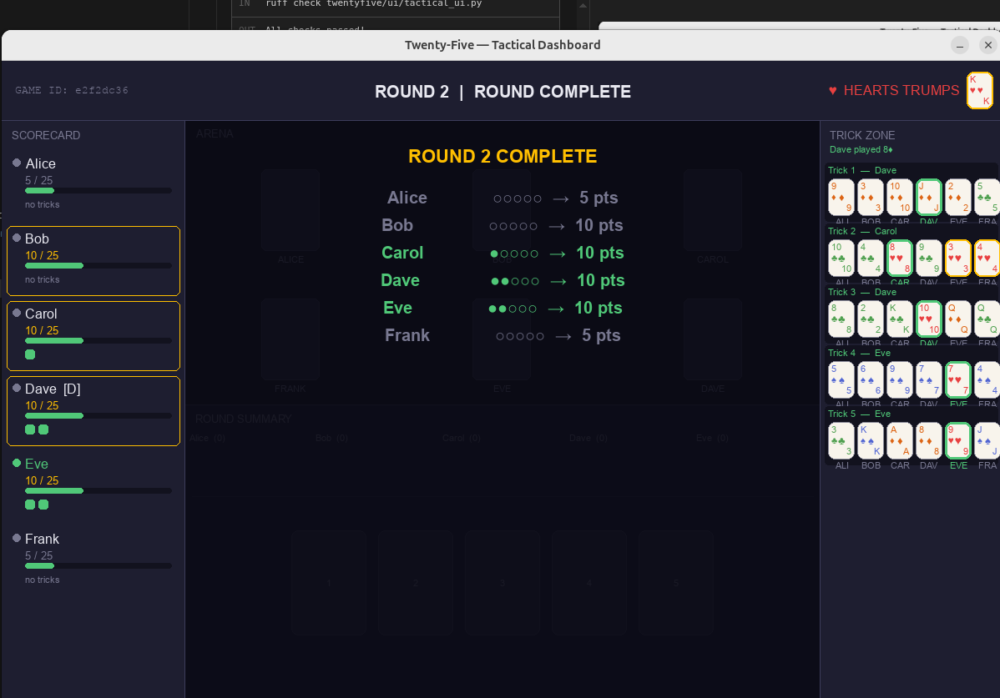

# Twenty-Five (25s)

A Python implementation of **Twenty-Five**, Ireland's national card game.

## About the Game

Twenty-Five is a trick-taking card game with roots going back over 500 years in Ireland,
historically known as *Maw*, then *Spoil-Five*, and eventually *Twenty-Five*. It is best
played with 4–6 players, uses a standard 52-card deck, and has a unique card ranking
system unlike any other common card game — where suit colour determines card strength
and the Ace of Hearts is always a trump card regardless of the trump suit.

The goal is simple: be the first player to reach **25 points** by winning tricks worth
5 points each.

---

## Setup

```bash
# Clone the repo, then create a virtual environment
python3 -m venv .venv
source .venv/bin/activate          # Windows: .venv\Scripts\activate

# CLI only
pip install -e ".[dev]"

# CLI + pygame desktop UI
pip install -e ".[gui,dev]"
```

---

## Playing the Game

### CLI (terminal)

```bash
python -m twentyfive
```

You will be prompted for the number of players (2–6), their names, and whether each is
a human or an AI. Press **Enter** to accept the defaults.

| | |
|---|---|
|  |  |
| *CLI Trick 5/5 — Peter's turn to play his last card* | *Round complete — full trick history and scores* |


| | |
|---|---|
|  |  |
| *Trick 4/5 — Frank playing his 4th card* | *Round complete — full trick history and scores* |


### Desktop GUI (pygame)

```bash
python -m twentyfive --gui
```

A 900 × 650 window opens. Click cards to select them, then click **Play Card** to
confirm. The **Auto-play**, **Rob/Pass**, and **Next Round** buttons appear as needed.

### Quick start — 1 human vs 3 AI

Jump straight into a 4-player game as yourself against three Enhanced AI opponents,
with seats and dealer chosen at random:

```bash
# CLI
python -m twentyfive --1v3 YourName

# Desktop GUI
python -m twentyfive --gui --1v3 YourName
```

---

## Player types

| Key | Type | Description |
|-----|------|-------------|
| `H` | Human | Interactive — prompts for card selection each turn |
| `R` | Random AI | Plays a random legal card |
| `A` | Heuristic AI | Rule-based strategy from STRATEGY.md |
| `E` | Enhanced AI | Heuristic + card tracking, endgame logic, rob strategy (default) |
| `M` | ISMCTS AI | Information-Set MCTS — fair hidden-hand search (strongest) |

---

## View modes

| Flag | Mode | Description |
|------|------|-------------|
| _(none)_ | Hidden-hand | Each player sees only their own cards; AI moves shown inline |
| `--seeall` | Master view | All hands visible simultaneously — good for spectating or testing |

---

## Benchmarking AI players

Run automated multi-game competitions between all five AI types:

```bash
python -m twentyfive.benchmark                              # 20 games, all 5 AI types
python -m twentyfive.benchmark --games 100 --seed 42 --mcts-sims 200
python -m twentyfive.benchmark --quiet                      # suppress per-game output
```

See [BENCHMARKING.md](twentyfive/ai/BENCHMARKING.md) for methodology and results.

---

## Project Status

| Phase | Status | Description |
|-------|--------|-------------|
| Core engine | ✅ Complete | Deck, dealing, trick logic, scoring, rob phase, audit log |
| CLI | ✅ Complete | Hidden-hand and master-view modes, ANSI colour, rob display |
| AI players | ✅ Complete | Random, Heuristic, Enhanced, MCTS (full-info), ISMCTS (fair) |
| Benchmark | ✅ Complete | Automated multi-game comparison framework |
| Desktop GUI | ✅ Complete | Pygame window; cards, scores, tricks, AI threading |
| Partnerships | 🔲 Planned | Team play (45s, 110 variants) |
| Web UI | 🔲 Planned | Flask / WebSocket front-end using the same GameController |

---

## AI Players

Five AI implementations of increasing sophistication. See the [AI docs](twentyfive/ai/)
for full details:

| Document | Description |
|----------|-------------|
| [AI_APPROACHES.md](twentyfive/ai/AI_APPROACHES.md) | Survey of AI approaches, design rationale, and implementation roadmap |
| [BENCHMARKING.md](twentyfive/ai/BENCHMARKING.md) | Benchmark methodology, results, and cooperative game-length analysis |

---

## Development

```bash
# Activate venv first (see Setup above), then:
python -m pytest               # run all 221 tests
python -m ruff check .         # lint
python -m mypy twentyfive/     # type check
```

| Task | Command |
|------|---------|
| Run all tests | `python -m pytest` |
| Run one test file | `python -m pytest tests/test_engine.py -v` |
| Format code | `ruff format .` |
| Lint | `ruff check .` |
| Type check | `mypy twentyfive/` |

---

## References

The following sources were used to establish the rules and strategy documented in
[RULES.md](RULES.md) and [STRATEGY.md](STRATEGY.md):

| Source | Description |
|--------|-------------|
| [Britannica — Twenty-Five](https://www.britannica.com/topic/twenty-five) | Overview, history, rules, and the Auction Forty-Fives variant |
| [Irish25s — How to Play](https://irish25s.herokuapp.com/howtoplay) | Online implementation rules including 45s mode and reneging detail |
| [GameRules — Twenty-Five](https://gamerules.com/rules/twenty-five-25/) | Card rankings by suit with full trump lookup tables |
| [OrwellianIreland — 25 (PDF)](http://www.orwellianireland.com/25.pdf) | Scholarly essay by Brian Nugent covering rules, history, etymology, and strategy; most authoritative source on traditional play and the social conventions of the game |
| [YouTube — Riffle Shuffle & Roll](https://www.youtube.com/watch?v=yhMMjVduF1k) | Video walkthrough of a full game with commentary on the ranking system and may-trump rule |
